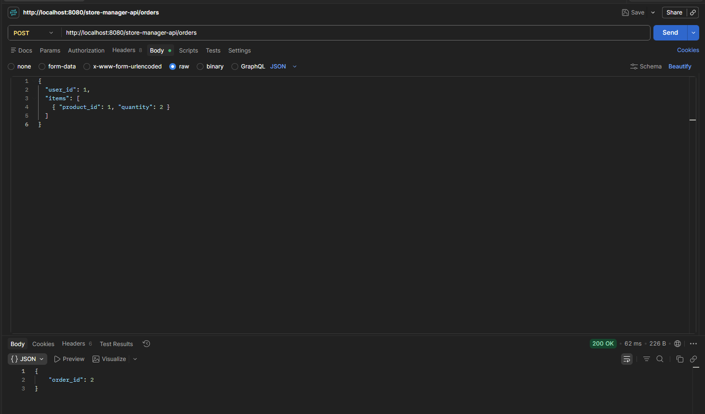
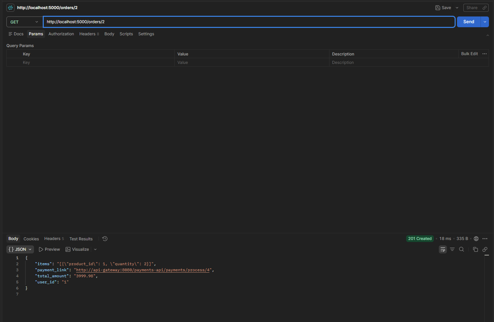
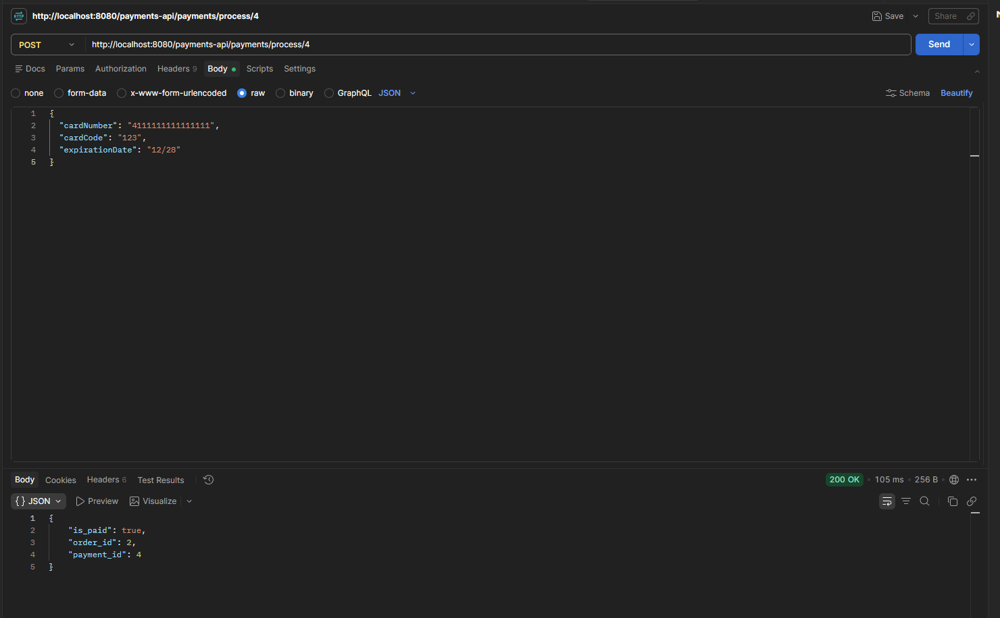
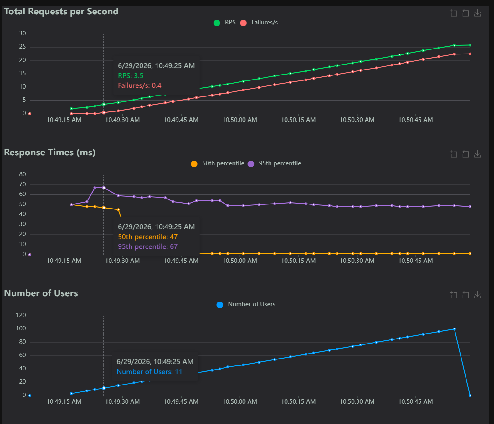
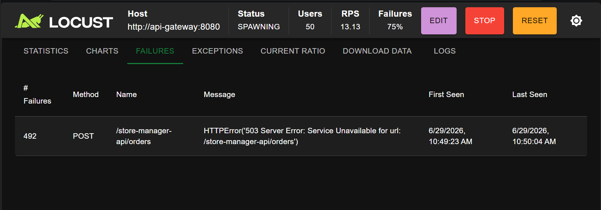
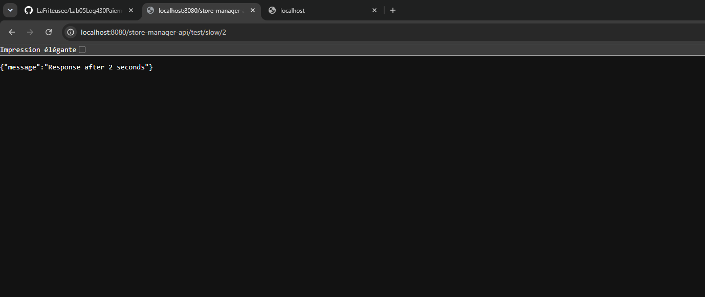
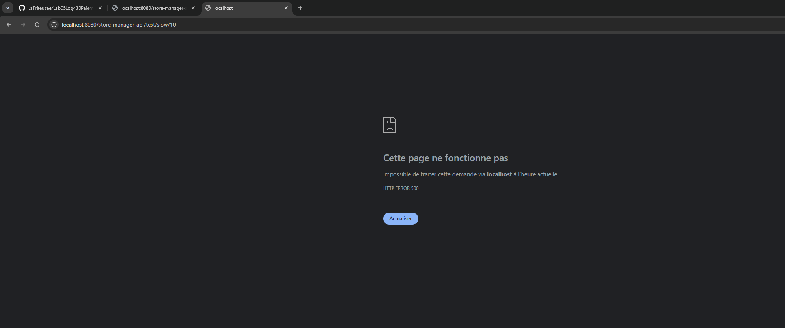
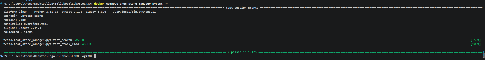
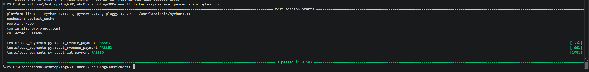

# Rapport - Labo 05 : Microservices, SOA, SBA, API Gateway, Rate Limit & Timeout

**Étudiant :** Thomas Journault  
**Cours :** LOG430 - Architecture logicielle  

---

## Question 1

Quelle réponse obtenons-nous à la requête à `POST /payments` ? Illustrez votre réponse avec des captures d'écran/du terminal.

Lors de la création d'une commande (`add_order`), la fonction `request_payment_link` envoie une requête `POST` au service de paiement à travers l'API Gateway (KrakenD) :

```python
response_from_payment_service = requests.post(
    'http://api-gateway:8080/payments-api/payments',
    json=payment_transaction,   # { user_id, order_id, total_amount }
    headers={'Content-Type': 'application/json'}
)
```

Le service de paiement crée la transaction et répond avec l'**identifiant du paiement** (`payment_id`) au format JSON :

```bash
$ curl -s -X POST http://localhost:8080/payments-api/payments \
    -H "Content-Type: application/json" \
    -d '{"user_id": 1, "order_id": 99, "total_amount": 3999.98}'

{"payment_id":5}
HTTP 200
```

On obtient donc un objet JSON `{"payment_id": <id>}`. Ce `payment_id` est ensuite utilisé pour construire le lien de paiement (`payment_link`) qui est stocké avec la commande, afin de pouvoir payer celle-ci plus tard.

Concrètement, lorsqu'on crée une commande via `POST /store-manager-api/orders`, on reçoit un `order_id` (ici `2`) :



En relisant la commande avec `GET /orders/2`, on constate que la commande possède bien un `payment_link` de la forme `http://api-gateway:8080/payments-api/payments/process/4`. Le suffixe `4` correspond au `payment_id` retourné par le `POST /payments` effectué en interne par `request_payment_link` :



La réponse de `POST /payments` est donc bien le `payment_id`, que l'on retrouve intégré dans le lien de paiement de la commande.

---

## Question 2

Quel type d'information envoyons-nous dans la requête à `POST payments/process/:id` ? Est-ce que ce serait le même format si on communiquait avec un service SOA, par exemple ? Illustrez votre réponse avec des exemples et captures d'écran/terminal.

Dans le corps (`body`) de la requête, nous envoyons les **données de carte de crédit** nécessaires au traitement du paiement, en **JSON** :

```json
{
  "cardNumber": "4111111111111111",
  "cardCode": "123",
  "expirationDate": "12/28"
}
```

Ces champs sont consommés par la méthode `_process_credit_card_payment` du service de paiement (`cardNumber`, `cardCode`, `expirationDate`).

**Est-ce le même format avec un service SOA ?** Non, pas nécessairement. Ici nous communiquons avec une architecture **REST/microservice** : échange léger en **JSON** sur HTTP, avec l'identité de la ressource portée par l'URL (`/payments/process/4`) et la méthode HTTP (`POST`).

Dans une architecture **SOA** classique, on utiliserait plutôt **SOAP** : un message **XML** structuré (enveloppe `<soap:Envelope>` avec `<soap:Header>` et `<soap:Body>`), décrit par un contrat **WSDL**, et l'opération est nommée dans le corps du message plutôt que par un verbe HTTP. Exemple équivalent en SOAP :

```xml
<soap:Envelope xmlns:soap="http://www.w3.org/2003/05/soap-envelope">
  <soap:Body>
    <ProcessPayment>
      <paymentId>4</paymentId>
      <cardNumber>4111111111111111</cardNumber>
      <cardCode>123</cardCode>
      <expirationDate>12/28</expirationDate>
    </ProcessPayment>
  </soap:Body>
</soap:Envelope>
```

Le format JSON/REST est donc plus léger et lisible, tandis que SOA/SOAP impose un contrat XML plus verbeux mais formellement typé.

La capture ci-dessous (panneau *Body* du haut) montre les informations de carte de crédit envoyées en JSON à `POST /payments-api/payments/process/4` :



---

## Question 3

Quel résultat obtenons-nous de la requête à `POST payments/process/:id` ?

Le service traite le paiement, met le statut de la transaction à *payé*, puis renvoie un JSON confirmant l'opération avec un statut **HTTP 200**. La capture ci-dessous (panneau *Body* du bas) montre le résultat de `POST /payments-api/payments/process/4` :

```json
{
  "is_paid": true,
  "order_id": 2,
  "payment_id": 4
}
```


La réponse contient :
- `is_paid: true` → le paiement a réussi ;
- `order_id: 2` → la commande associée ;
- `payment_id: 4` → l'identifiant de la transaction traitée.

---

## Question 4

Quelle méthode avez-vous dû modifier dans `log430-labo5-payment` et qu'avez-vous modifiée ? Justifiez avec un extrait de code.

J'ai modifié la méthode **`update_order`** du fichier `src/controllers/payment_controller.py`, ainsi que son **appel** dans `process_payment`.

Au départ, `update_order` était un *stub* vide et l'appel était incorrect (valeurs codées en dur) :

```python
# TODO: appelez la méthode correctement
update_order(0, False)
...
def update_order(order_id, is_paid):
    """ Trigger order update once it is paid"""
    pass
```

**1. Appel corrigé** dans `process_payment` — on transmet le vrai `order_id` et le statut réel obtenu de `update_status_to_paid` :

```python
# Notifier le Store Manager que la commande est payée
update_order(update_result["order_id"], update_result["is_paid"])
```

**2. Implémentation de `update_order`** — elle fait un appel `PUT` à l'endpoint `/store-manager-api/orders` **à travers l'API Gateway (KrakenD)**, comme exigé, pour que la commande passe à `is_paid = true` côté Store Manager :

```python
def update_order(order_id, is_paid):
    """ Trigger order update once it is paid.
    Appelle l'endpoint PUT /orders du Store Manager via l'API Gateway (KrakenD)
    pour mettre à jour le statut is_paid de la commande. """
    try:
        response = requests.put(
            'http://api-gateway:8080/store-manager-api/orders',
            json={"order_id": order_id, "is_paid": is_paid},
            headers={'Content-Type': 'application/json'}
        )
        logger.debug(f"Store Manager notifié pour la commande {order_id}: {response.status_code} {response.text}")
        return response.ok
    except Exception as e:
        logger.error(f"Échec de la mise à jour de la commande {order_id}: {e}")
        return False
```

**Justification du choix :** on passe par KrakenD (`api-gateway:8080`) plutôt que d'appeler `store_manager:5000` directement. Ainsi, si l'hôte ou le chemin du Store Manager change, seule la configuration de KrakenD doit être mise à jour, sans toucher au service de paiement (faible couplage).

**Vérification :** avant le traitement la commande est `is_paid="False"`, et après l'appel à `POST /payments-api/payments/process/4` elle passe à `is_paid="True"` :

```bash
# Avant
{"is_paid":"False", ... "payment_link":".../process/4", "total_amount":"3999.98"}

# POST /payments-api/payments/process/4  ->  {"is_paid":true,"order_id":2,"payment_id":4}

# Après
{"is_paid":"True", ... "payment_link":".../process/4", "total_amount":"3999.98"}
```

<!-- TODO : tu peux ajouter une capture Postman montrant la commande is_paid=true après paiement -->

---

## Question 5

À partir de combien de requêtes par minute observez-vous les erreurs 503 ? Justifiez avec des captures d'écran de Locust.

Le rate limiting est configuré dans `config/krakend.json` sur l'endpoint `POST /store-manager-api/orders` :

```json
"extra_config": {
  "qos/ratelimit/router": {
    "max_rate": 200,
    "every": "1m"
  }
}
```

Cela autorise **200 requêtes par minute** (par client/routeur). Au-delà de ce seuil, KrakenD rejette les requêtes supplémentaires avec un statut **HTTP 503 (Service Unavailable)**.

On observe donc les erreurs 503 **dès que le débit dépasse environ 200 requêtes/minute**, soit **~3,3 requêtes/seconde** soutenues.

**Observation lors du test de charge Locust** (host `http://api-gateway:8080`, spawn rate 1 utilisateur/s) : aucune erreur n'apparaît tant qu'il y a 9 utilisateurs ou moins. Les premières erreurs 503 surgissent **entre 10 et 11 utilisateurs**. C'est cohérent avec la configuration : avec un `wait_time` de 1 à 3 s par utilisateur, environ 10-11 utilisateurs suffisent pour atteindre ~3,3 req/s, c'est-à-dire le seuil de 200 req/min.

Le graphe ci-dessous le montre : à **10:49:25 (11 utilisateurs)**, le débit atteint **RPS 3,5** et la courbe des *Failures/s* (rouge) commence à décoller (0,4) — c'est le moment où le rate limit se déclenche :



Plus la charge augmente, plus la proportion d'erreurs grimpe. Avec 50 utilisateurs (RPS ≈ 13), on atteint déjà **75 % d'échecs**, tous dus au statut **HTTP 503 (Service Unavailable)** renvoyé par KrakenD sur `POST /store-manager-api/orders` :



**Conclusion :** le rate limiting protège bien l'API en rejetant les requêtes au-delà de 200/min (≈ 3,3 req/s), seuil atteint dès ~10-11 utilisateurs concurrents dans ce test.

---

## Question 6

Que se passe-t-il dans le navigateur quand vous faites une requête avec un délai supérieur au timeout configuré (5 secondes) ? Quelle est l'importance du timeout dans une architecture de microservices ? Justifiez votre réponse avec des exemples pratiques.

L'endpoint `/store-manager-api/test/slow/{delay}` est configuré dans KrakenD avec un `timeout` de **5 s** :

```json
{
  "endpoint": "/store-manager-api/test/slow/{delay}",
  "method": "GET",
  "backend": [
    {
      "url_pattern": "/test/slow/{delay}",
      "host": ["http://store_manager:5000"],
      "timeout": "5s"
    }
  ]
}
```

**Comportement observé :**

- `http://localhost:8080/store-manager-api/test/slow/2` (délai 2 s, **inférieur** au timeout) : la réponse arrive normalement après ~2 s avec un statut **HTTP 200** :
  ```
  {"message":"Response after 2 seconds"}
  HTTP 200 | temps: 2,00 s
  ```

  

- `http://localhost:8080/store-manager-api/test/slow/10` (délai 10 s, **supérieur** au timeout) : KrakenD **interrompt** l'attente exactement à 5 s et renvoie une erreur (corps vide, statut **HTTP 500**) sans jamais attendre la réponse complète du backend :
  ```
  (corps vide)
  HTTP 500 | temps: 5,00 s
  ```

  

Dans le navigateur, l'utilisateur ne reçoit donc **pas** le message « Response after 10 seconds » : au bout de 5 s, le navigateur affiche la page d'erreur « Cette page ne fonctionne pas — **HTTP ERROR 500** », car la gateway a abandonné la requête. À titre de comparaison, en appelant directement le backend `http://localhost:5000/test/slow/10` (sans passer par KrakenD), la réponse arrive bien après 10 s avec un HTTP 200 — preuve que c'est bien le timeout de la gateway qui coupe la requête.

**Importance du timeout dans une architecture de microservices :**

1. **Éviter le blocage en cascade (fail-fast)** : sans timeout, un service lent immobiliserait les *threads*/connexions de tous les services appelants. Le timeout libère rapidement les ressources et évite qu'une lenteur locale ne se propage à tout le système (effet domino).
2. **Protéger l'expérience utilisateur** : mieux vaut renvoyer rapidement une erreur exploitable (et déclencher un *retry* ou un *fallback*) que de laisser l'utilisateur attendre indéfiniment.
3. **Résilience et stabilité** : combiné à des patrons comme le *circuit breaker* et le *retry*, le timeout est une brique essentielle pour qu'un système distribué reste disponible même quand l'un de ses composants est dégradé.

**Exemple pratique :** si le service de paiement devenait très lent (ex. surcharge), un appel `POST /payments` sans timeout bloquerait la création de commandes côté Store Manager. Avec un timeout de 5 s, le Store Manager échoue vite, peut journaliser l'incident et répondre à l'utilisateur, au lieu de rester figé.

---

## Activité 7 — Test de charge sur la création de commande

Test de charge réalisé avec Locust sur la création de commande (`POST /orders`), avec **50 utilisateurs** (spawn rate 5/s) pendant **60 secondes**. Deux scénarios ont été comparés : à travers l'API Gateway KrakenD (rate limit actif) et directement sur le backend `store_manager` (sans rate limit).

| Métrique | Via KrakenD (rate limit 200/min) | Direct `store_manager` (sans limite) |
|---|---|---|
| Requêtes totales | 1404 | 1303 |
| Échecs (HTTP 503) | 1200 (85,5 %) | 0 (0 %) |
| Débit | 23,5 req/s | 21,8 req/s |
| Temps médian | 1 ms | 94 ms |
| p95 | 54 ms | 610 ms |
| Temps max | 117 ms | 1016 ms |

**Observations sur les performances :**

- **À travers la gateway :** environ **85 % des requêtes sont rejetées** avec un statut **HTTP 503**, très rapidement (~1 ms), car KrakenD applique le rate limit dès que le seuil de 200 requêtes/minute est dépassé. Seules ~200 commandes par minute parviennent réellement au backend. Le rate limiting joue donc son rôle de protection : le backend n'est jamais saturé, au prix du rejet des requêtes excédentaires.

- **Directement sur le backend :** **toutes les requêtes réussissent** (0 % d'échec), mais la latence réelle de création d'une commande est bien plus élevée et **augmente avec la charge** : médiane à 94 ms, p95 à 610 ms et un maximum à ~1 s. Cela reflète le coût réel du traitement (requêtes SQL, mise à jour du stock, synchronisation Redis, appel au service de paiement) et un début de saturation lorsque 50 utilisateurs sollicitent le service simultanément.

**Conclusion :** sans protection, le Store Manager absorbe toute la charge mais voit ses temps de réponse se dégrader fortement. Avec le rate limiting de KrakenD en façade, le backend reste rapide et stable, la gateway absorbant et rejetant le surplus de trafic — un compromis essentiel pour préserver la disponibilité du service en cas de pic ou d'attaque (DDoS).

<!-- TODO (optionnel) : insérer une capture Locust (Charts / Statistics) de ton propre test de charge -->

---

## Annexe — Tests

Les tests unitaires/d'intégration sont exécutés dans les conteneurs avec `pytest`.

**Store Manager** (`docker compose exec store_manager pytest -v`) — 2 tests réussis :



```
tests/test_store_manager.py::test_health      PASSED  [ 50%]
tests/test_store_manager.py::test_stock_flow  PASSED  [100%]
======================= 2 passed in 1.12s =======================
```

**Service de paiement** (`docker compose exec payments_api pytest -v`) — 3 tests réussis :



```
tests/test_payments.py::test_create_payment   PASSED  [ 33%]
tests/test_payments.py::test_process_payment  PASSED  [ 66%]
tests/test_payments.py::test_get_payment      PASSED  [100%]
======================= 3 passed in 0.64s =======================
```
